# 基于springboot的社区医院信息平台

---
### 👉作者QQ ：1556708905 微信：zheng0123Long (支持定制修改、部署调试、定制毕设)

### 👉接网站建设、小程序、H5、APP、各种系统等

---

#### 介绍

随着现代医疗服务需求的不断增加，社区医院的信息化管理显得尤为重要。然而，现有系统常面临数据分散、管理效率低下等问题，无法全面满足医院和患者的需求。基于SpringBoot的社区医院信息平台应运而生，旨在解决这些管理难题，提升医院的整体管理效率和患者服务质量。该系统通过角色划分和功能模块的设计，实现了对医院日常运作的高效管理和信息的无缝对接。系统支持管理员、护士、医生、患者及药品管理员五种角色，每种角色具有特定的功能模块，确保各自职责的高效履行。

#### 技术栈

后端技术栈：Springboot+Mysql+Maven

前端技术栈：Vue+Html+Css+Javascript+ElementUI

开发工具：Idea+Vscode+Navicate

#### 系统功能介绍

管理员角色功能模块

个人中心：查看和编辑个人信息，包括修改密码和更新联系方式。  
患者管理：管理医院患者的信息，包括新增、修改和删除患者资料。  
护士管理：管理护士信息，确保护士团队的高效运作。  
医生管理：管理医生信息，分配和调整医生的工作任务。  
药品管理员管理：管理药品管理员的信息，确保药品管理工作的有序进行。  
护士角色功能模块

个人中心：查看和编辑个人信息，包括修改密码和更新联系方式。  
患者管理：管理分配给自己的患者信息，跟踪患者的治疗情况。  
待检查列表管理：管理待检查患者的列表，确保检查工作的及时进行。  
检查结果管理：记录和管理患者的检查结果，确保信息的准确和及时更新。  
注射列表管理：管理需要注射的患者列表，安排注射任务。  
完成注射列表管理：记录已完成的注射任务，确保信息的完整性。  
注射取药列表管理：管理需要取药的患者信息，确保患者及时取药。  
医生角色功能模块

个人中心：查看和编辑个人信息，包括修改密码和更新联系方式。  
患者管理：管理自己的患者信息，提供医疗诊断和治疗方案。  
检查结果管理：查看和管理患者的检查结果，提供专业诊断意见。  
诊断信息管理：记录和管理患者的诊断信息，确保治疗方案的及时调整。  
患者角色功能模块

个人中心：查看和编辑个人信息，包括修改密码和更新联系方式。  
检查结果管理：查看自己的检查结果，了解自身健康状况。  
诊断信息管理：查看医生提供的诊断信息，跟进治疗方案。  
取药列表管理：查看需要取药的药品列表，确保及时取药。  
药费结算管理：管理和结算自己的药费，确保医疗费用的及时支付。  
药品管理员角色功能模块

个人中心：查看和编辑个人信息，包括修改密码和更新联系方式。  
诊断信息管理：查看和管理患者的诊断信息，确保药品的正确使用。   
注射列表管理：管理需要注射的药品信息，确保药品供应的及时性。  
药品信息管理：管理医院药品的信息，包括新增、修改和删除药品信息。  
药品进价管理：管理药品的进价信息，确保药品成本的有效控制。  
取药列表管理：管理患者的取药信息，确保药品的正确发放。  
注射取药列表管理：管理注射和取药的药品信息，确保药品的安全使用。  
药费结算管理：管理和结算药品费用，确保药品费用的及时支付。  

#### 系统作用

对管理员的作用

高效管理：提供全面的管理工具，帮助管理员高效地管理医院的各类信息，确保医院运作的高效性和准确性。  
人员调配：管理员可以通过系统合理分配和调整护士、医生和药品管理员的工作任务，提高工作效率。  

对护士的作用  

便捷操作：护士可以通过系统高效管理患者信息和各项医疗任务，确保医疗工作的顺利进行。  
信息跟踪：系统提供检查结果和注射列表管理，帮助护士及时跟踪和更新患者信息。 
 
对医生的作用  

精准诊断：医生可以通过系统查看和管理患者的检查结果和诊断信息，提供精准的医疗服务。  
高效记录：系统帮助医生高效记录和管理患者的诊断信息，确保医疗记录的完整性。 
 
对患者的作用  

信息获取：患者可以通过系统及时查看自己的检查结果和诊断信息，了解自身健康状况。  
便捷管理：系统提供药费结算和取药列表管理，方便患者进行药品管理和费用结算。  
对药品管理员的作用  

药品管理：药品管理员可以通过系统高效管理药品信息和进价信息，确保药品供应的及时性和安全性。  
费用结算：系统提供药费结算管理，帮助药品管理员高效处理药品费用，确保费用的准确支付。  

#### 系统功能截图

代码结构

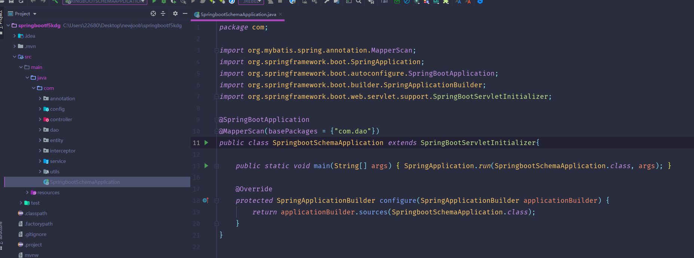

数据库表

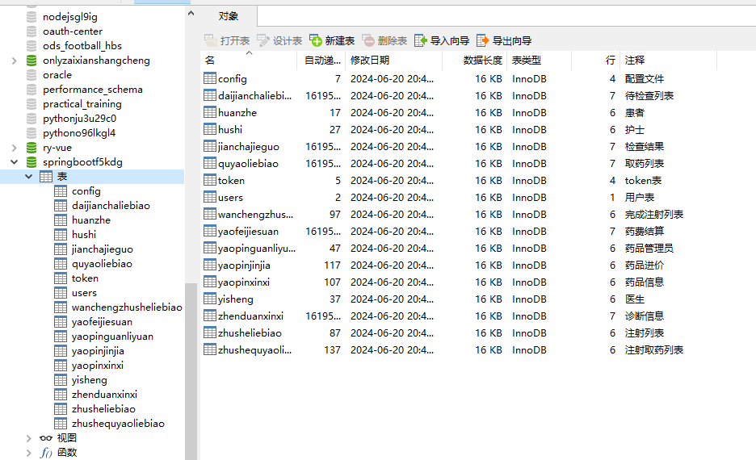

登录

患者管理

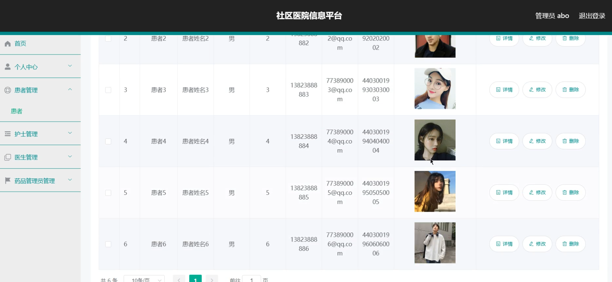

医生管理

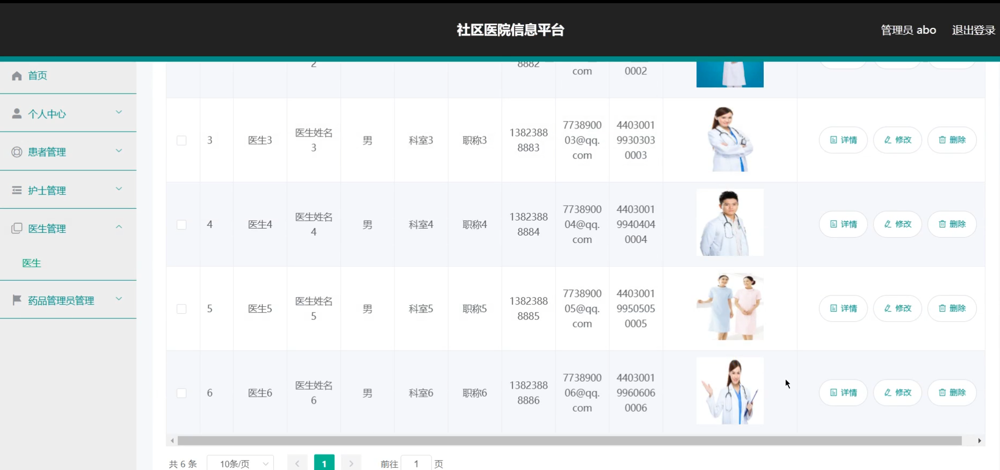

护士管理

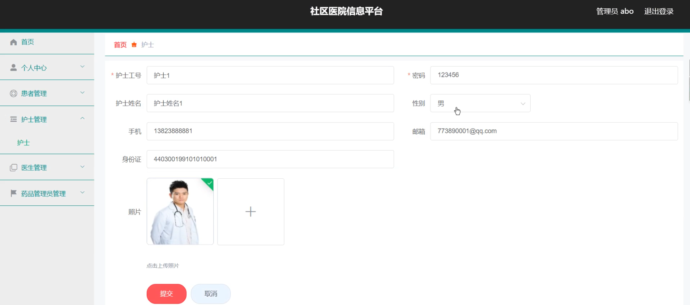

药品管理员管理

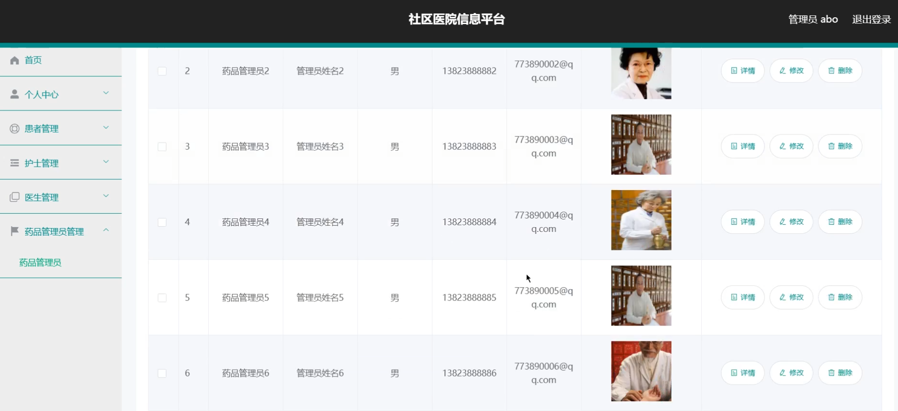

护士端页面

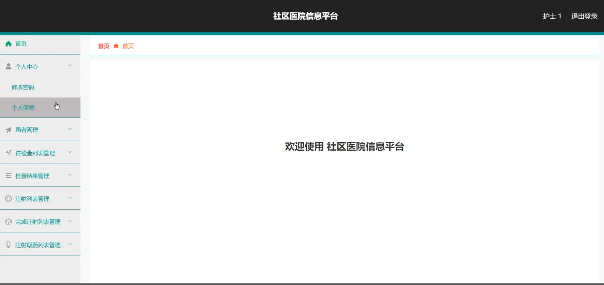

医生端页面

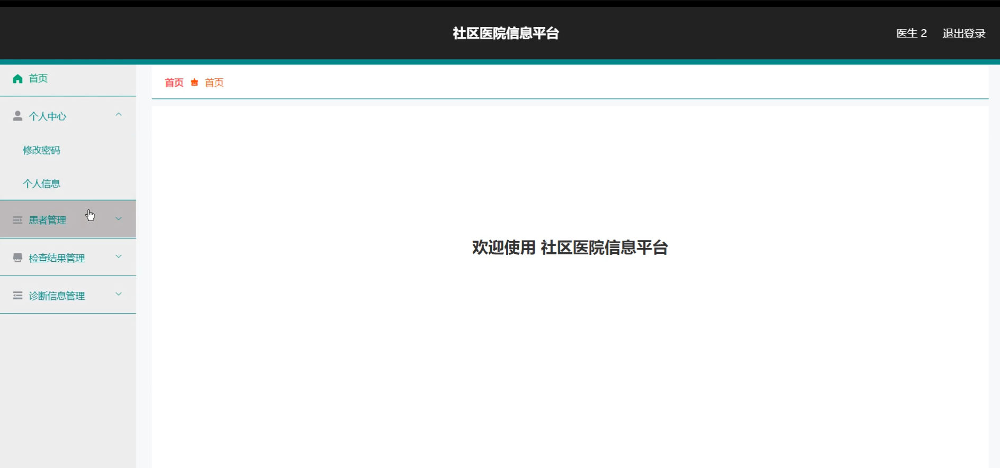

药品管理员端

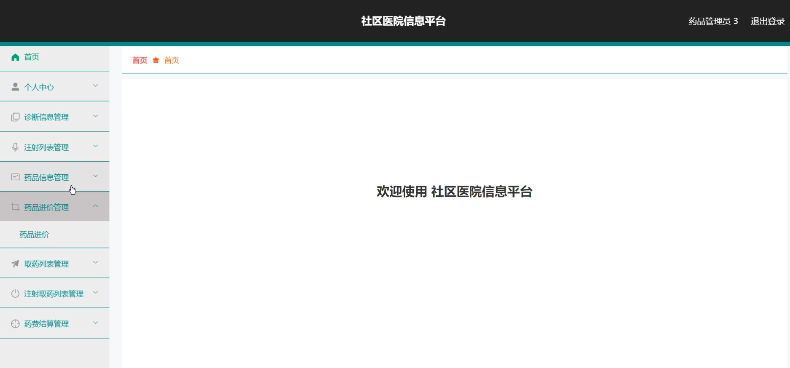

患者端

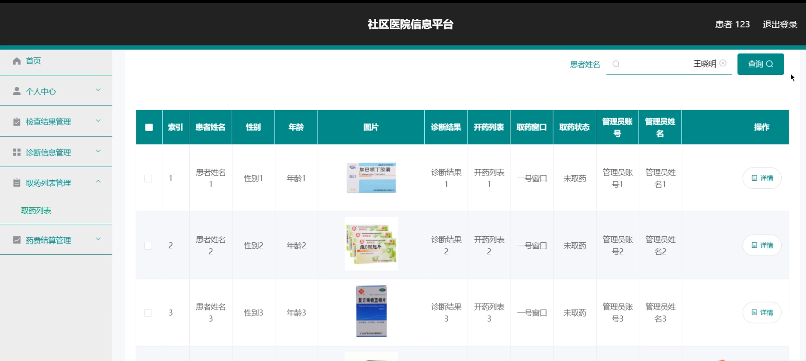

检查结果

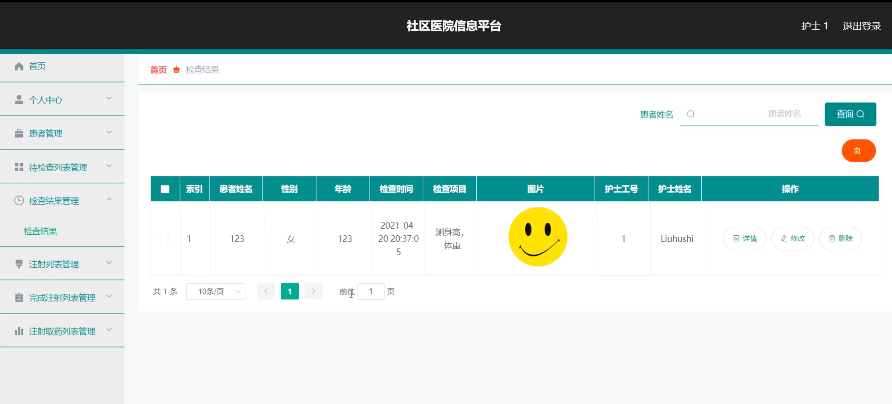

#### 总结

基于SpringBoot的社区医院信息平台通过角色分工和功能模块的设计，实现了医院管理的高效化和便捷化。管理员可以通过系统高效管理医院的各类信息，确保医院的顺利运营；护士和医生可以通过系统高效管理患者信息，提高医疗服务质量；患者可以通过系统便捷获取医疗信息和管理药品费用；药品管理员可以通过系统高效管理药品信息，确保药品供应的安全和及时。该系统不仅提升了医院管理的效率，也为患者提供了优质的医疗服务体验。

#### 使用说明

创建数据库，执行数据库脚本 修改jdbc数据库连接参数 下载安装maven依赖jar 启动idea中的springboot项目

后台地址：http://localhost:8080/springbootf5kdg/admin/dist/index.html

管理员  abo 密码 abo
